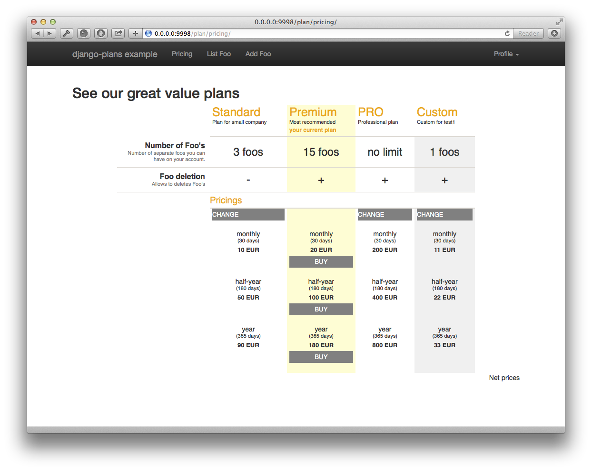
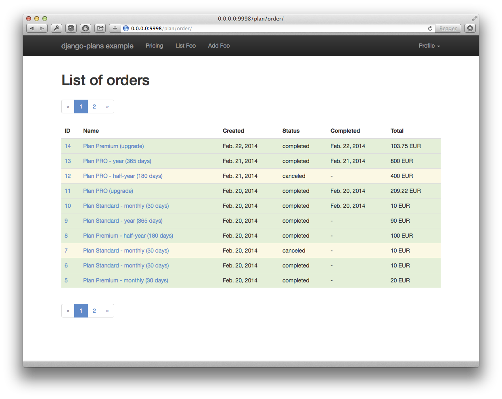
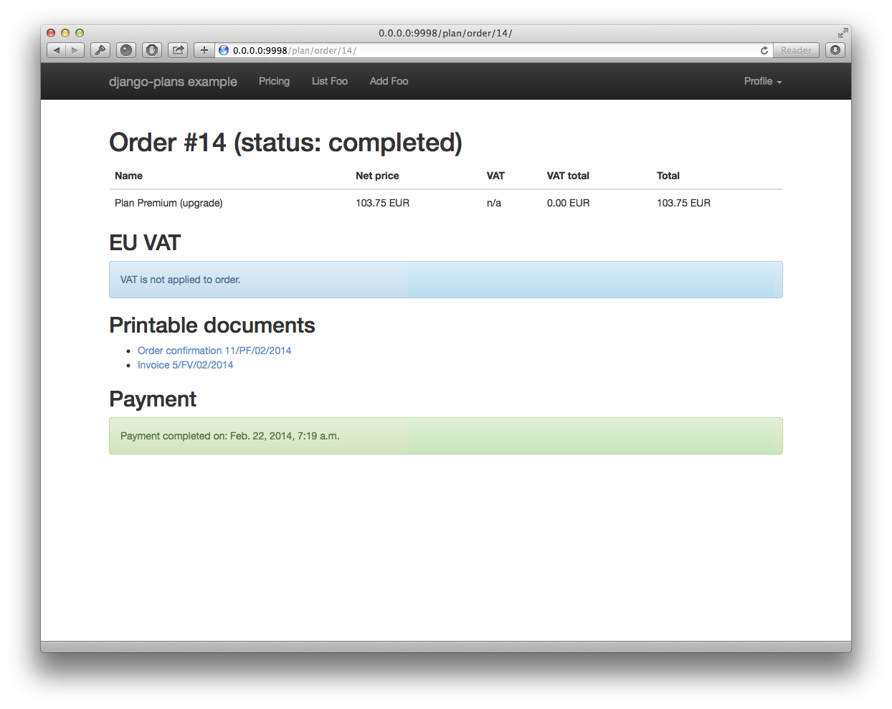

Welcome to django-plans
=======================

.. image:: https://codecov.io/gh/cypreess/django-plans/branch/master/graph/badge.svg
   :target: https://codecov.io/gh/cypreess/django-plans
.. image:: https://travis-ci.org/cypreess/django-plans.svg?branch=master   
   :target: https://travis-ci.org/cypreess/django-plans
   
Django-plans is a pluggable app for managing pricing plans with quotas and accounts expiration. 

Features currently supported:

* Multiple plans,
* Support for user custom plans.
* Flexible model for parametrizing plans (quota).
* Customizable billing periods (plan pricing),
* Order total calculation using customizable taxation policy (e.g. in EU calculating VAT based on seller/buyer countries and VIES)
* Invoicing,
* Account expiratons + E-mail remainders.

Documentation: https://django-plans.readthedocs.org/

Master branch: Support for django 2.0, support for py3.6

License
-------

Django Plans is licensed and distributed under MIT licesne..
