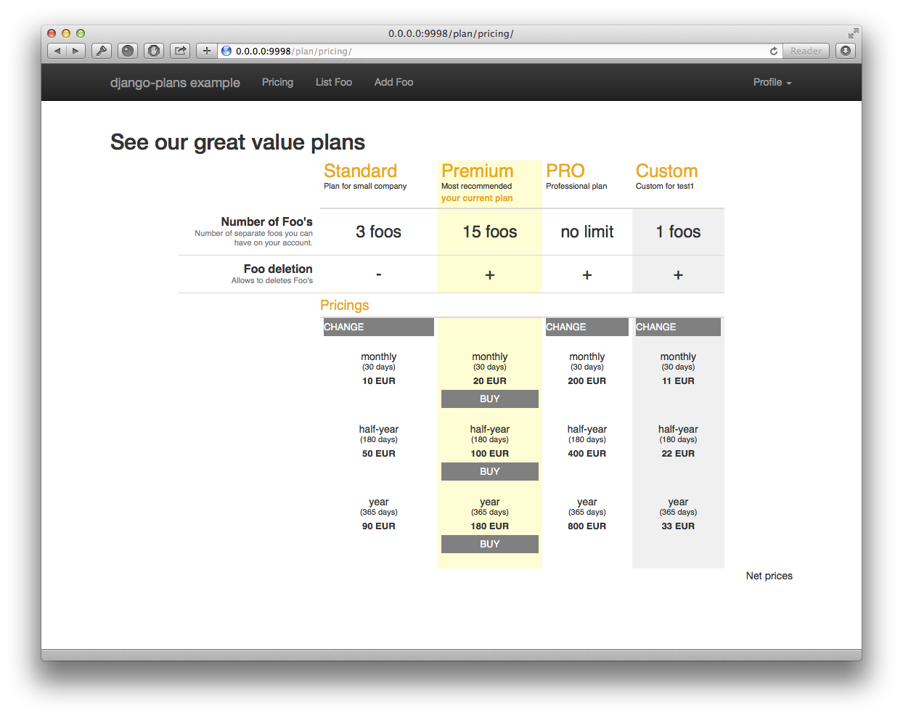
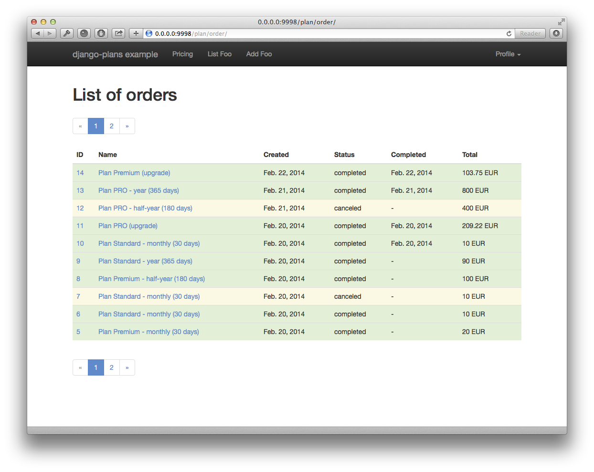
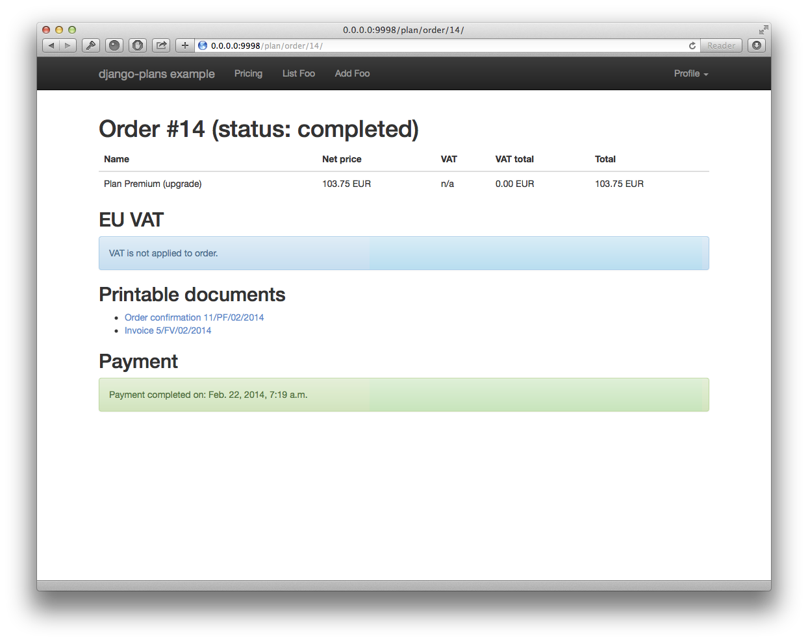

Welcome to django-plans
=======================

.. image:: https://img.shields.io/pypi/v/django-plans.svg
   :target: https://pypi.org/project/django-plans/
   :alt: PyPI version

.. image:: https://img.shields.io/pypi/pyversions/django-plans.svg
   :target: https://pypi.org/project/django-plans/
   :alt: Python versions

.. image:: https://codecov.io/gh/django-getpaid/django-plans/branch/master/graph/badge.svg?token=oEyv7odqUW
   :target: https://codecov.io/gh/django-getpaid/django-plans
   :alt: Code coverage

Django-plans is a pluggable app for managing pricing plans with quotas and accounts expiration.

Features currently supported:

* Multiple plans,
* Support for user custom plans.
* Flexible model for parametrizing plans (quota).
* Customizable billing periods (plan pricing),
* Order total calculation using customizable taxation policy (e.g. in EU calculating VAT based on seller/buyer countries and VIES)
* Invoicing,
* Account expiratons + E-mail remainders.

Documentation: https://django-plans.readthedocs.org/

Master branch: Support for Django 5.2 - 6.1, support for Python 3.11 - 3.14 (Django 6.x on Python 3.12+)

License
-------

Django Plans is licensed and distributed under MIT licesne..
